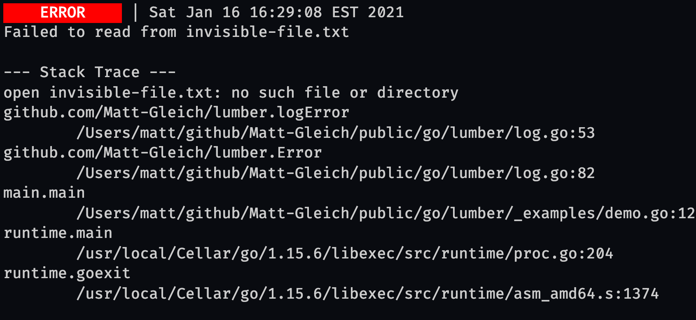
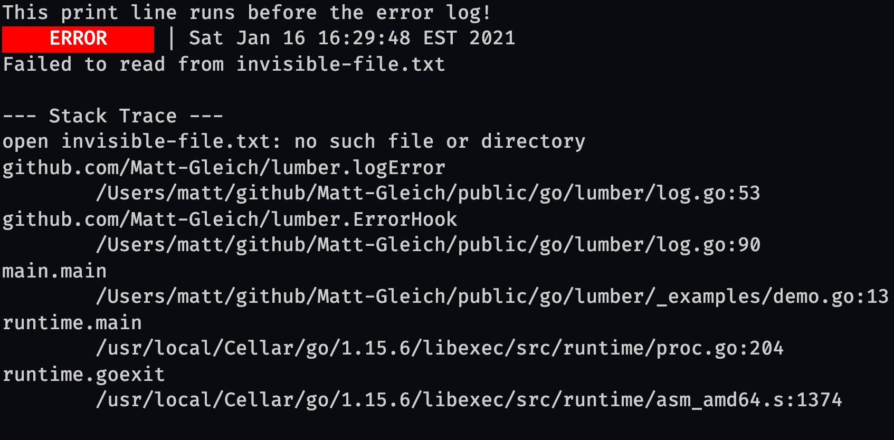
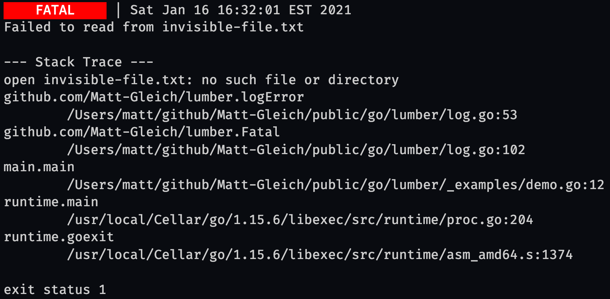
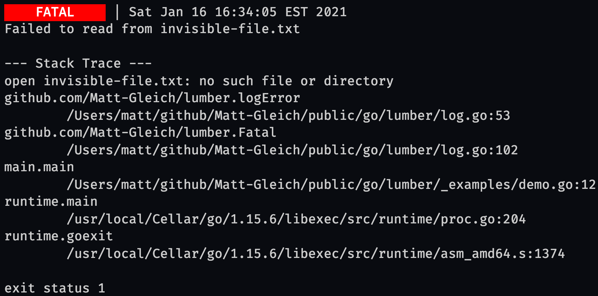

<!-- DO NOT REMOVE - contributor_list:data:start:["Matt-Gleich"]:end -->

# lumber


🪵 A feature-rich and easy to use logger for golang

- [lumber](#lumber)
  - [🌲 Common Logs](#-common-logs)
    - [`lumber.Success()`](#lumbersuccess)
    - [`lumber.Info()`](#lumberinfo)
    - [`lumber.Debug()`](#lumberdebug)
    - [`lumber.Warning()`](#lumberwarning)
    - [`lumber.Error()`](#lumbererror)
    - [`lumber.ErrorHook()`](#lumbererrorhook)
    - [`lumber.ErrorMsg()`](#lumbererrormsg)
    - [`lumber.Fatal()`](#lumberfatal)
    - [`lumber.FatalHook()`](#lumberfatalhook)
  - [⚙️ Customization](#️-customization)
  - [⏰ Changing the log time](#-changing-the-log-time)
  - [🙌 Contributing](#-contributing)
  - [👥 Contributors](#-contributors)

## 🌲 Common Logs

### [`lumber.Success()`](https://pkg.go.dev/github.com/Matt-Gleich/lumber#Success)

Output a success log.

Demo:

```go
package main

import (
    "time"

    "github.com/Matt-Gleich/lumber"
)

func main() {
    lumber.Success("Loaded up the program!")
    time.Sleep(2 * time.Second)
    lumber.Success("Waited 2 seconds!")
}
```

Outputs:


### [`lumber.Info()`](https://pkg.go.dev/github.com/Matt-Gleich/lumber#Info)

Output an info log.

Demo:

```go
package main

import (
    "time"

    "github.com/Matt-Gleich/lumber"
)

func main() {
    lumber.Info("Getting the current year")
    now := time.Now()
    lumber.Info("Current year:", now.Year())
}
```

Outputs:


### [`lumber.Debug()`](https://pkg.go.dev/github.com/Matt-Gleich/lumber#Debug)

Output a debug log.

Demo:

```go
package main

import (
    "os"

    "github.com/Matt-Gleich/lumber"
)

func main() {
    homeDir, _ := os.UserHomeDir()
    lumber.Debug("User's home dir is", homeDir)
}
```

Outputs:


### [`lumber.Warning()`](https://pkg.go.dev/github.com/Matt-Gleich/lumber#Warning)

Output a warning log.

Demo:

```go
package main

import (
    "time"

    "github.com/Matt-Gleich/lumber"
)

func main() {
    now := time.Now()
    if now.Year() != 2004 {
        lumber.Warning("Current year isn't 2004")
    }
}
```

Outputs:


### [`lumber.Error()`](https://pkg.go.dev/github.com/Matt-Gleich/lumber#Error)

Output an error log. If `err != nil` the error will automatically get logged to the console.

Demo:

```go
package main

import (
    "io/ioutil"

    "github.com/Matt-Gleich/lumber"
)

func main() {
    fName := "invisible-file.txt"
    _, err := ioutil.ReadFile(fName)
    lumber.Error(err, "Failed to read from", fName)
}
```

Outputs:



### [`lumber.ErrorHook()`](https://pkg.go.dev/github.com/Matt-Gleich/lumber#ErrorHook)

Output an error log. If `err != nil` the error will automatically trigger the given function and get logged to the console.

Demo:

```go
package main

import (
    "fmt"
    "io/ioutil"

    "github.com/Matt-Gleich/lumber"
)

func main() {
    fName := "invisible-file.txt"
    _, err := ioutil.ReadFile(fName)
    lumber.ErrorHook(
        func() {
            fmt.Println("This print line runs before the error log!")
        },
        err, "Failed to read from", fName,
    )
}
```

Outputs:



### [`lumber.ErrorMsg()`](https://pkg.go.dev/github.com/Matt-Gleich/lumber#ErrorMsg)

Output an error message.

Demo:

```go
package main

import "github.com/Matt-Gleich/lumber"

func main() {
    lumber.ErrorMsg("Ahhh stuff broke")
}
```

Outputs:


### [`lumber.Fatal()`](https://pkg.go.dev/github.com/Matt-Gleich/lumber#Fatal)

Output a fatal log. If `err != nil` the error will automatically get logged to the console and the program will exit (default code is 1).

Demo:

```go
package main

import (
    "io/ioutil"

    "github.com/Matt-Gleich/lumber"
)

func main() {
    fName := "invisible-file.txt"
    _, err := ioutil.ReadFile(fName)
    lumber.Fatal(err, "Failed to read from", fName)
}
```

Outputs:



### [`lumber.FatalHook()`](https://pkg.go.dev/github.com/Matt-Gleich/lumber#FatalHook)

Output a fatal log. If `err != nil` the following will happen:

1. Given function will run
2. Error is logged
3. Program exits (default code is 1)

Demo:

```go
package main

import (
    "fmt"
    "io/ioutil"

    "github.com/Matt-Gleich/lumber"
)

func main() {
    fName := "invisible-file.txt"
    _, err := ioutil.ReadFile(fName)
    lumber.FatalHook(
        func() {
            fmt.Println("This print line runs before the error log!")
        },
        err, "Failed to read from", fName,
    )
}
```

Outputs:



## ⚙️ Customization

You can customize lumber by changing any of its global variables:

| **Variable Name**      | **Description**                                                                     | **Default Value**      | **Type**   |
| ---------------------- | ----------------------------------------------------------------------------------- | ---------------------- | ---------- |
| `lumber.NormalOut`     | The output file for Debug, Success, Warning, and Info                               | `os.Stdout`            | `*os.File` |
| `lumber.ErrOut`        | The output file for Fatal and Error                                                 | `os.Stderr`            | `*os.File` |
| `lumber.ExitStatus`    | Fatal exit code                                                                     | `1`                    | `int`      |
| `lumber.Padding`       | If the log should have an extra new line at the bottom                              | `true`                 | `bool`     |
| `lumber.ColoredOutput` | If the output should have color                                                     | `true`                 | `bool`     |
| `lumber.TrueColor`     | If the output colors should be true colors. Default is true if terminal supports it. | `has256ColorSupport()` | `bool`     |

Example of changing one of these variables:

```go
package main

import "github.com/Matt-Gleich/lumber"

func main() {
    lumber.ColoredOutput = false
    lumber.Debug("See! No color")
}
```

## ⏰ Changing the log time

All normal log functions have a twin function that accepts a custom time. All of these functions are suffixed with `WithTime`.

## 🙌 Contributing

Before contributing please read the [CONTRIBUTING.md file](https://github.com/Matt-Gleich/lumber/blob/master/CONTRIBUTING.md).

<!-- DO NOT REMOVE - contributor_list:start -->

## 👥 Contributors

- **[@Matt-Gleich](https://github.com/Matt-Gleich)**

<!-- DO NOT REMOVE - contributor_list:end -->
